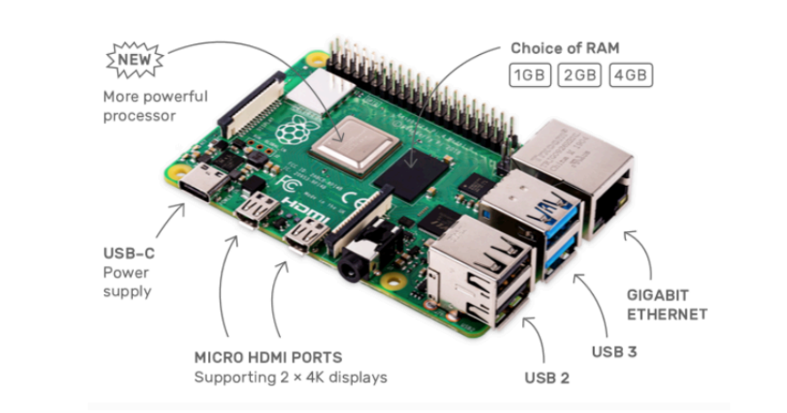

# Python and Deeper into Raspberry Pi & Raspbian

## Segment 1: Python-1 ( Data Structure )

### Debug tools

-   Pyflakes
-   pylint
-   PyChecker
-   pep8

### Data Structures

-   Array
-   [List](#List)
-   [Dict](#Dictionary)
-   [Tuple](#Tuples)
-   [Sets](#Sets)
-   Strings

### Tuples

?> **Tuples** are immutable, which means once defined you cannot delete, add / edit it. Which is ordered and unchangeable. Allows duplicate member

Handy if you want to pass the data to someone else but you don't want them to modify it.

### Dictionary

?> They are made up of key-value pairs, unordered, changeble and indexed. No duplicate members

### Sets

?> Collection of unique objects

It's an unordered collection, **mutable**. Handy when going through a huge dataset.

### List

?> is a collection which is ordered and changeable. Allows duplicate members.

## Segment 2: Python-2 ( Files I/O Modules, classes )

### Basic I/O functions

-   open()
-   read()
-   readline()
-   write()
-   close()

>   Other terms you should know:
>
>   -   **shutil package**: Python uses Linux perform various file operations. Many of these are in `shutil` package.
>   -   **Globbing**: nicest way to find out what is inside the directory, by using `glob` package.
>   -   **Pickling**:  saving the contents of a variable to a file in such a way that the file can be later be loaded to get original data back.

### Modules

You can put definitions in a file and use them in ascript or in an interactive instance of interpreter (`import` stuff).

Such a file is called a *module*

?> Definitions from a module can be imported into other modules 

### Python in-built modules/libraries

Some of them are:

>   random, string, datetime, math, pickle, Numpy, SciPy, twisted,...
>
>   https://docs.python.org/3/library/

### Classes

Yes it's OOP.

!> **But python allows to have multiple inheritance**. Which is impossible in Java or C#.

?> Multilevel inheritance is also possible in Python. *We can inherit a derived class from another derived class*. This process is known as multilevel inheritance.

#### Abstract Class (ABCs), Interface

Yes you can have abstract classes.

But there is no interfaces in Python as it implements multiple inheritance of classes. 

-   However you can use ABCs as interfaces clerverly and,
-   There are third-party implementations of interfaces for Python

## Raspberry Pi 4



### GPIO

-   The Raspberry Pi comes with a set of 40 exposed vertical pins on the board. These pins are a *General Purpose Input/Output* interface
-   The GPIO pins are there explicitly for the end user to have low-level hardware access directly to the board for the purposes of
    -   Attaching other hardware boards peripherals, LCD display screens,
    -   Sense HAT and 
    -   other hardware devices to the PI

## Sense HAT

-   Attached on top of the Pi via the 40 GPIO Pins
-   Sense HAT has several integrated circuit based sensors that can be used for many different types of experiments, applications, and even games.

-   It allows the Pi to sense the world around it

-   Sense HAT has an 8x8 RGB LED matrix, a five-button joystick includes the following sensers:
    -   Gyroscope, Accelerometer, Magnetometer, Temperature, Barometric, pressure, Humidity

## Raspbian

?> Raspbian is official Linux operating system that you install  on your microSD card.

### Raspbian packages

Once you have SSH'd into Raspbian, you can open Terminal and check for all the packages with the following command:

```bash
dpkg --get-selections
```


Install package name:

```bash
sudo apt-get install packageName
```

